# 刘积铭 · 项目作品集

✉️ 2030146103@qq.com ｜ 📍 深圳
开源合集：https://oshwhub.com/donnan

> 本作品集收录硬件研发、调试与试产全流程中的关键成果。每一段都附上实物 / PCB 实物 / 3D 渲染图作为佐证。

## 作品集概览

本作品集汇总 2 段企业实习经历、5 个代表性硬件项目与在校竞赛获奖 / 社团经历，覆盖消费级外骨骼、具身智能机器人、RoboMaster 竞赛机器人、能源 / 储能小车与无刷电机 FOC 驱动器方向，完整呈现从原理图设计、PCB Layout 到调试、试产与量产交付的硬件工程能力。所有实物 / PCB / 3D 渲染图均为本人项目一手素材。

| # | 类别 | 项目 / 经历 | 角色 | 周期 |
| :---: | :---: | :--- | :--- | :---: |
| 01 | 企业实习 | 深圳未来动力科技 · 双臂具身智能机器人 + 可移动底盘 | 硬件工程师（实习） | 2026.05 – 至今 |
| 02 | 企业实习 | 深圳市亦方创新科技 · 消费级运动下肢外骨骼 | 硬件工程师（实习） | 2025.11 – 2026.05 |
| 03 | 硬件项目 | RoboMaster 步兵机器人 | 硬件负责人 | 2023.09 – 2025.09 |
| 04 | 硬件项目 | RoboMaster 工程机器人 | 硬件负责人 | 2024.09 – 2025.09 |
| 05 | 硬件项目 | 工训竞赛太阳能小车 | 硬件核心成员 | 2024.09 – 2025.06 |
| 06 | 硬件项目 | 灰度循迹与 IMU 惯性导航小车 | 硬件核心开发者 | 2024.05 – 2024.09 |
| 07 | 硬件项目 | 基于 ODrive 的 FOC 驱动器 | 毕业设计 | 2026.01 – 2026.06 |
| 08 | 在校经历 | 校 RM 机器人战队 · 工训协会 ｜ 竞赛获奖与社团任职 | 硬件组队员 / 副部长 | 2023.06 – 2025.10 |

---

## 工作经历

### 深圳未来动力科技有限公司 ｜ 硬件工程师（实习） （2026.05 – 至今）

**项目：双臂具身智能机器人 + 可移动底盘**

- 负责基于 OpenArm 项目开发的机器人及其衍生型号硬件系统搭建，覆盖主控、电源、传感器接口、线束装配与测试验证全链路，输出硬件设计文档并支撑批量生产。
- 参与机器人 SoC 主控板选型与底板外围硬件设计（对外高速接口、DDR3 等），实现 24V 锂电管理、电流分配与断电制动方案；负责单板转产与量产维护、问题定位。
- 负责具身智能机器人可移动底盘与外骨骼遥操等项目的硬件开发，构建多传感器融合硬件架构，完成 IMU、关节编码器硬件模块设计与深度相机、激光雷达接口电路设计。
- 制定整机线束规范与接插件选型标准，输出装配 SOP；建立硬件测试体系（电源纹波、温升、可靠性）与信号完整性优化，建立产线出货测试并完成小批量生产交付。

**工作成果**

| 机器人整机电源 + 下位机控制 | 电池电量显示 + 功率开关 |
| :---: | :---: |
| <a href="imgs/full/img_17.png">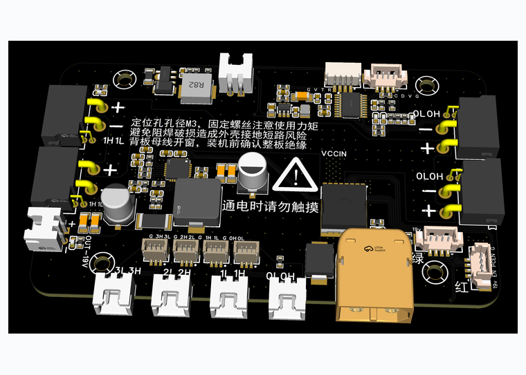</a> | <a href="imgs/full/img_18.png">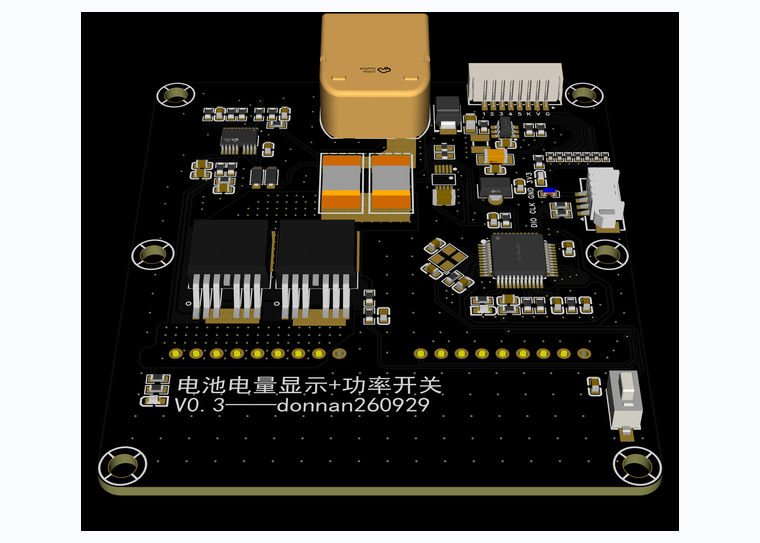</a> |
| 整机电源树与下位机控制 | 电量显示 / 功率开关板 |

| USB 3.0 信号整形 |
| :---: |
| <a href="imgs/full/img_19.png">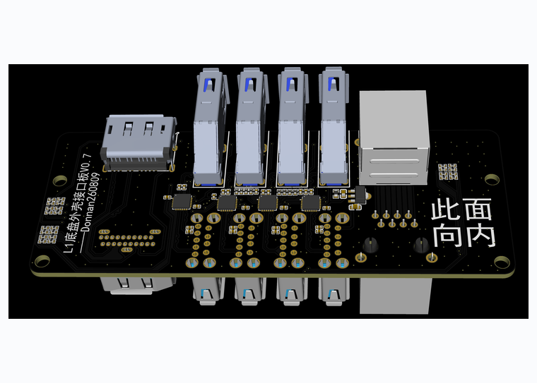</a> |
| Redriver 整形电路 |

> 以上为缩略预览，点击图片可查看高清原理图。

### 深圳市亦方创新科技有限公司 ｜ 硬件工程师（实习） （2025.11 – 2026.05）

**项目：[消费级运动下肢外骨骼](https://vastnaut.com/home)**

- 参与消费级下肢运动外骨骼硬件研发与系统集成，负责无刷关节电机电调模块、IMU 传感器、电机磁编码器等 PCB / FPC 硬件模块开发与优化，参与方案制定到样机制作等关键流程，了解外骨骼设备小型化与轻量化布局需求。
- 协助推动产品由样品进入试量产阶段，输出硬件 BOM 与生产文件，对接 PCB 板厂与供料商并跟进生产流程；编写技术文档与 SOP，确保生产交付符合设计规范。
- 负责单板硬件测试与可靠性测试，参与整机低功耗、效率及信号完整性（SI）等关键性能测试，输出测试报告并推动问题定位，完成硬件风险评估与优化方案攻关。

---

## 一、RoboMaster 步兵机器人 ｜ 硬件负责人 （2023.09 – 2025.09）

**项目概述**：负责一款竞技类步兵机器人的完整硬件系统开发，覆盖电源架构、主控板、PCB 布局、通信网络与控制链路全流程。

**核心技术贡献**：

- **电源架构**：以 6S 锂电池 + 超级电容模组构建混合动力系统，满足底盘电机瞬时大功率需求，提升动态响应与稳定性。
- **核心模块**：参与研发基于 STM32F4 的 4 层主控板与大功率超级电容管理模块，完成原理图、PCB 至调试验证；集成 9轴 IMU 与关节磁编码器。
- **驱动与通信**：参与电机选型与舵轮 / 全向轮底盘设计，通过 CAN 总线与串口构建分布式通信网络。
- **系统集成**：集成 IMU 与导电滑环实现云台 360° 无限位旋转与自瞄；与软件 / 机械团队联调，实现全向移动、视觉追踪与自动发射。

**项目成果**：硬件在高强度对抗赛中稳定运行，获 2024 RoboMaster 机甲大师超级对抗赛国家级三等奖、2025 年国家级二等奖。

### 实物 / 硬件图

| 整机 | 主控板 PCB | 比赛现场联调 |
| :---: | :---: | :---: |
| 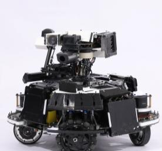 | 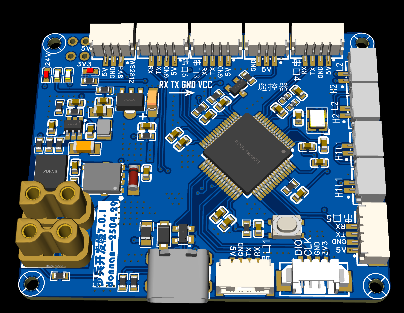 | 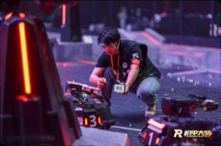 |
| 步兵机器人整机 | 4 层主控板 PCB | 比赛现场调试 |

| 线束测试治具 | 机器人电源板 |
| :---: | :---: |
| 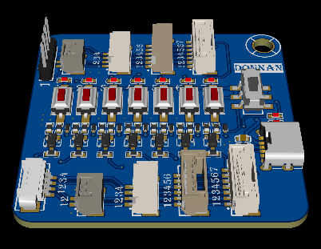 | 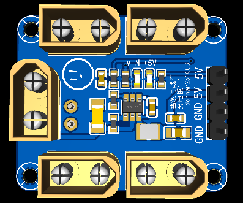 |
| 线束测试治具 | 机器人电源板 |

---

## 二、RoboMaster 工程机器人 ｜ 硬件负责人 （2024.09 – 2025.09）

**项目概述**：负责麦克纳姆轮底盘 + 龙门架 + 多自由度机械臂搬运机器人的整机电气系统规划与核心硬件开发。

**核心技术贡献**：

- **系统架构**：主导设计整机电源分配、通信拓扑（CAN / RS485 / 串口）与传感器布局，制定主控 / 执行器 / 外设的电气接口标准，提升模块化与可维护性。
- **核心模块**：研发基于 STM32F407 的车载主控板，集成光耦隔离 3 路 NMOS 气泵驱动模块、磁编码器等。
- **磁编码器 FOC 驱动器**：设计关节磁编码器（3D 渲染见下图），用于关节 / 轮毂电机矢量控制。
- **整机控制**：电气系统驱动麦轮底盘、龙门架与 4 自由度机械臂；通过负压吸取与遥控实现物体全向抓取 - 转运 - 放置自动化。

**项目成果**：项目获 2025 年 RoboMaster 机甲大师超级对抗赛国家级二等奖。

### 实物 / 硬件图

| 工程机器人整车 | 工程机器人主控板 | 车载主控板 PCB |
| :---: | :---: | :---: |
| 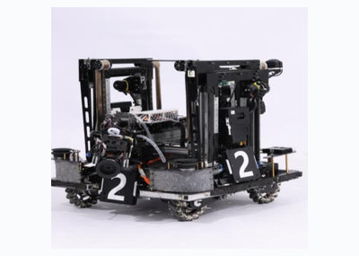 | 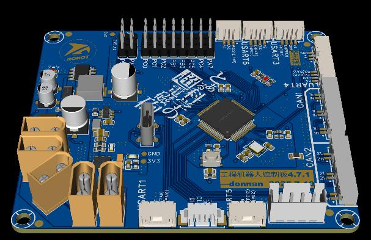 | 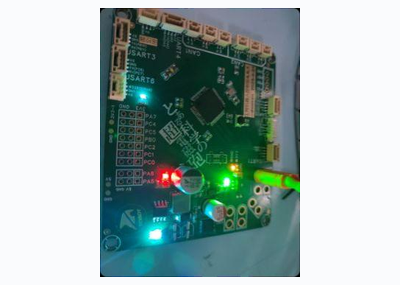 |
| 工程机器人整车 | 工程机器人主控板 | 车载主控板 PCB |

| NMOS 气泵驱动 / 电源 | 关节磁编码器 |
| :---: | :---: |
| 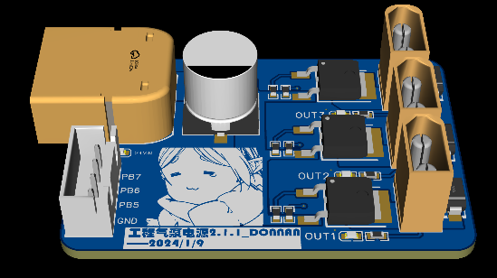 | 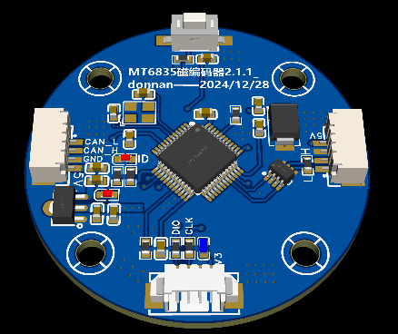 |
| 电源 / 气泵驱动 | 关节磁编码器 |

---

## 三、工训竞赛太阳能小车 ｜ 硬件核心成员 （2024.09 – 2025.06）

**项目概述**：参与设计并制作一款以太阳能 + 超级电容为储能、智能循迹与场地识别的小车。

**核心技术贡献**：

- **能源管理**：设计太阳能能量转换系统。CN3305 充电 IC 对超级电容组进行高效充电，电容组采用被动均衡保证安全；Buck-Boost 电路输出稳定电压为控制与驱动供电。
- **控制与驱动**：主控 STM32F103 + DRV8837 驱动有刷电机。
- **功能集成**：集成 NFC 读卡与语音模块，实现场地信息识别与语音播报。

**项目成果**：2024 福建省大学生工程训练综合能力竞赛省级三等奖。

### 实物 / 硬件图

| 扩展板 | 电容充电电路 | 超级电容模组 |
| :---: | :---: | :---: |
| 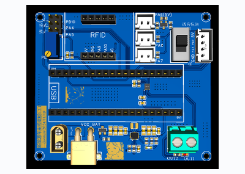 | 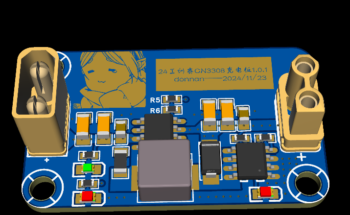 | 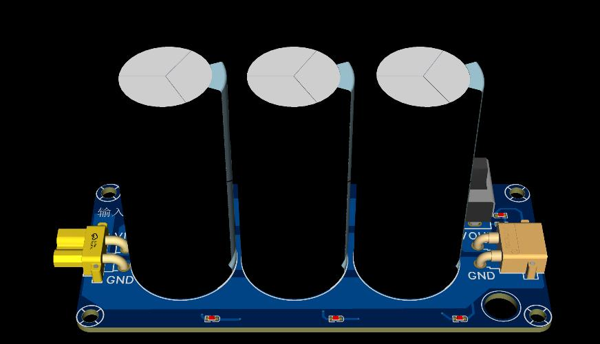 |
| 扩展板 PCB | 电容充电电路 | 超级电容储能模组 |

---

## 四、灰度循迹与 IMU 惯性导航小车 ｜ 硬件核心开发者 （2024.05 – 2024.09）

**项目概述**：基于 TI MSPM0G3507 的循迹与惯性导航小车硬件系统开发，负责中控核心板、系统扩展板、IMU 等模块的硬件设计。

**核心技术贡献**：

- **核心板与扩展板设计**：参与设计中控核心板，主导开发系统扩展板（集成 DCDC-LDO 电源树、CAN 通信、IMU），为系统提供稳定供电、可靠通信与精准姿态感知。
- **最小系统板**：以 MSPM0G3507 为核心的硬件基础平台，整合供电、通信与栅极驱动 / 三相全桥驱动电路，作为运动控制与驱动的硬件底层。
- **传感与驱动集成**：集成 5 路灰度传感器阵列，进行电机与驱动选型，实现精准路径识别、惯性导航与闭环运动控制。
- **系统调试与优化**：完成硬件设计，参与算法参数整定，保障小车在复杂赛道下稳定高速运行。

**项目成果**：2024 全国大学生电子设计竞赛福建赛区省级一等奖。

### 实物 / 硬件图

| 扩展板 | 最小系统板 | 最小系统板 |
| :---: | :---: | :---: |
| 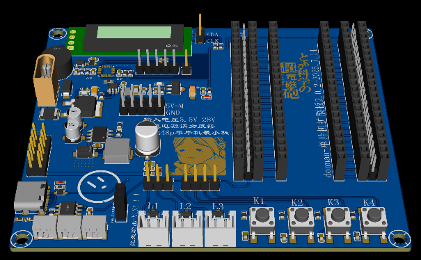 | 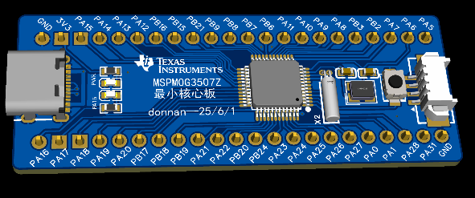 | 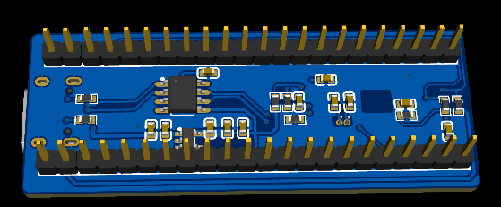 |
| 扩展板 PCB | 最小系统板（控制核心板） | 最小系统板 |

---

## 五、基于 ODrive 的 FOC 驱动器 ｜ 毕业设计 （2026.01 – 2026.06）

**项目概述**：参考开源方案设计开发无刷电机高性能矢量控制（FOC）驱动器硬件，覆盖控制 / 驱动 / 功率三级架构。

**核心技术贡献**：

- **架构设计**：「STM32F407 控制核心 → DRV8303 栅极驱动 → 6 颗 NMOS 三相全桥」三级功率架构。
- **电路设计**：12–24V 输入，集成缓启动与过压 / 过流保护；基于 DRV8303 设计栅极驱动，6 颗 NMOS 搭建三相全桥功率电路。
- **信号处理**：霍尔传感器实现电机位置反馈，结合相电流采样与 CMSIS-DSP 运算实现有感 FOC 实时控制。
- **性能指标**：支持 24V 输入，完成原理图到 PCB 设计并开展驱动性能测试与优化。

**项目成果**：2025.06 大学生创新创业训练计划「基于 FOC 算法的无刷电机智能控制系统」校级立项。

---

## 六、相关技能

- **PCB 设计与开发**：熟练嘉立创 EDA、Altium Designer、KiCad，具备 2–8 层板原理图与 Layout 能力；熟悉 DFM / EMC / SI / PI 基础与 PCB 生产工艺，能完成从设计到量产的转化。
- **硬件调试与测试**：熟练使用示波器、逻辑分析仪、电子负载做电源纹波 / 温升 / 可靠性与 EMC 验证；具备贴片焊接、BOM 整理与量产出货经验。
- **电子理论基础**：掌握数字 / 模拟电路、电路分析、电机学、电力电子等课程基础；能阅读器件数据手册并理解典型单元电路工作原理。
- **嵌入式系统与仿真**：熟悉 ARM Cortex-M（STM32 / GD32）开发，掌握 Multisim 电路仿真；能配合完成驱动与功能调试。
- **电源与电机**：具备电源树、锂电管理与大电流配电设计能力；熟悉无刷 FOC 与有刷电机驱动。
- **机器人系统**：熟悉机器人结构、硬件及电控系统开发设计流程；具备跨机械 / 软件 / 算法协同与基础项目管理经验。

---

## 七、在校部分竞赛获奖

- 2025 第二十五届全国大学生机器人大赛 RoboMaster 机甲大师超级对抗赛全国赛：国家级二等奖
- 2024 第二十四届全国大学生机器人大赛 RoboMaster 机甲大师超级对抗赛全国赛：国家级三等奖
- 2024 全国大学生电子设计竞赛福建赛区：省级一等奖
- 2025 全国大学生工程实践与创新能力大赛（福建分区分赛工程基础赛道）：省级一等奖
- 2024 福建省机器人大赛暨海峡两岸大学生机器人竞赛：省级二等奖
- 2025 全国 3D 大赛 18 周年精英联赛数字工业赛道：省级一等奖
- 2024–2025 RoboMaster 机甲大师高校联盟赛 3v3 对抗赛：连续两年省级二等奖
- 2025 全国大学生电子设计竞赛福建赛区：省级三等奖
- 2024 福建省大学生工程训练综合能力竞赛：省级三等奖
- 2025.06 大学生创新创业训练计划「基于 FOC 算法的无刷电机智能控制系统」：校级立项
- 2025.06 大学生创新创业训练计划「双向光伏储能电源管理系统」：校级立项
- 另获挑战杯、蓝桥杯、软件设计、商业计划等多项国家级 / 省级竞赛奖项

---

## 八、在校经历

**校 RM 机器人战队 ｜ 硬件组正式队员 （2023.06 – 2025.06）**

- 作为团队硬件核心成员，参与「步兵机器人」与「工程机器人」硬件系统规划、开发与迭代，具备复杂机电系统全周期开发经验。
- 负责机器人供电架构设计与多种通信链路（CAN / 串口 / RS485）搭建，参与主控开发板、无线充电模块、超级电容管理等关键硬件模块开发与调试。
- 与软件、机械团队高效协同，实现机器人运动控制、视觉追踪与弹丸发射等核心功能的集成与联调，硬件系统在国家级竞技赛事中表现稳定可靠。
- 负责硬件系统日常维护、故障诊断与排查，保障研发与高强度赛事训练顺利进行。

**机电院工训协会 ｜ 副部长 （2024.09 – 2025.10）**

- 协助制定协会年度工作计划，统筹组织多场硬件操作培训与工程实践项目，覆盖会员超过 100 人。
- 主导设计与实施「万用表、数字电源与 PCB 焊接」等基础技能培训课程，系统提升会员工程实践能力。
- 负责协会工训设备、耗材的采购计划与日常维护管理，优化资源使用流程。
- 上述培训与组织经验可迁移至部门技术能力建设相关工作。
